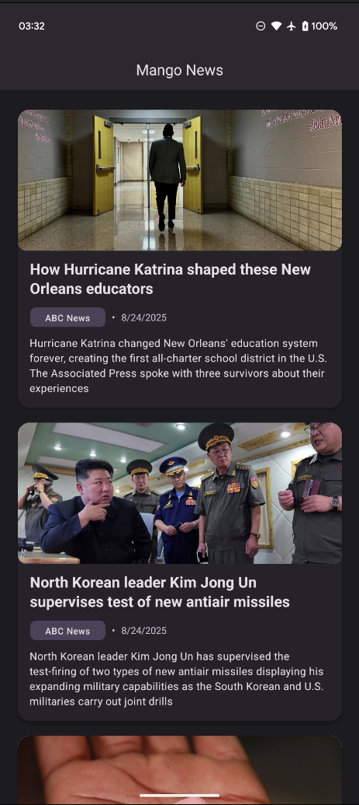
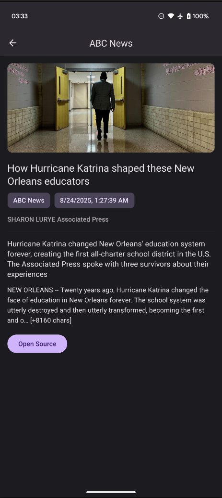

# Mango Interview News App

Note: This app was built as a barebones showcase of the NewsAPI with the minimum implementation necessary to have both list and details screens.
A more robust and feature rich version of this app can be found on [M004 - News & Pokemon App](https://github.com/Melkoh02/M004-News-Pokemon-App), I highly recommend to check that one out instead.

## Quick Start

```bash
# 1) Clone
git clone git@github.com:Melkoh02/mango-interview-news-app.git
cd mango-interview-news-app

# 2) Install dependencies
yarn install

# 3) Setup environment variables
cp .env.example .env    # then edit API_KEY_NEWS and others as needed

# 4) Start Metro (keep this terminal open)
yarn start

# 5) In another terminal, build & run Android
yarn android 
````

The `.env.example` file is already in the repo:
```dotenv
API_BASE_URL=https://newsapi.org/v2/
API_KEY=3c****************************0c
```

Remove the '.example' extension and add your API_KEY for the NewsAPI before running the app.

## Development/Tested Environment

This project was developed and tested under the following setup.  
For instructions on preparing your own system, see the official React Native guide (highly recommended!):  
[Set Up Your Environment](https://reactnative.dev/docs/set-up-your-environment)

* **OS**: Ubuntu 24.04 (dev machine)
* **Node**: ≥ 18 (tested with v22.15)
* **Java**: 17 (OpenJDK)
* **Android SDK**: Installed + `ANDROID_HOME` configured
* **Yarn**: 1.22.22

Example `.zshrc` snippet:

```bash
export NVM_DIR="$HOME/.nvm"
[ -s "$NVM_DIR/nvm.sh" ] && . "$NVM_DIR/nvm.sh"
export JAVA_HOME=/usr/lib/jvm/java-17-openjdk-amd64
export PATH=$JAVA_HOME/bin:$PATH
export ANDROID_HOME=$HOME/Android/Sdk
export PATH=$PATH:$ANDROID_HOME/emulator
export PATH=$PATH:$ANDROID_HOME/platform-tools
```

## Screenshots
<p align="center">
  
  
</p>